# Architecture Overview

This module deploys a multi-region serverless SSR platform on AWS with automatic failover.

## Detailed Architecture Diagram

```mermaid
graph TB
    %% Users and DNS
    User[👤 User Request]
    R53[Route 53<br/>subdomain.domain.com<br/>Simple A Record Alias]

    %% CloudFront
    CF[☁️ CloudFront Distribution<br/>Global CDN<br/>ACM SSL Certificate]
    OAI[CloudFront OAI]

    %% Origin Groups
    OG_Lambda[Lambda Origin Group<br/>Failover: 500, 502, 503, 504]
    OG_S3[S3 Origin Group<br/>Failover: 500, 502, 503, 504]

    %% Primary Region
    subgraph Primary["🌎 Primary Region (us-east-1)"]
        LFURL1[Lambda Function URL]
        LF1[Lambda Function<br/>app-primary<br/>Node.js 20.x<br/>512MB / 10s]
        S3D1[S3: Deployment Bucket<br/>function.zip]
        S3S1[S3: Static Assets Primary<br/>/_nuxt/* files]
        DDB1[DynamoDB Table<br/>visits<br/>Streams enabled]
    end

    %% DR Region
    subgraph DR["🌍 DR Region (us-west-2)"]
        LFURL2[Lambda Function URL]
        LF2[Lambda Function<br/>app-dr<br/>Node.js 20.x<br/>512MB / 10s]
        S3D2[S3: Deployment Bucket<br/>function.zip]
        S3S2[S3: Static Assets DR<br/>Replicated]
        DDB2[DynamoDB Replica<br/>Global Table]
    end

    %% IAM
    LR[IAM Role<br/>Lambda Execution Role<br/>+ DynamoDB Policy<br/>+ S3 Policy<br/>+ CloudWatch Logs]

    %% Request Flow
    User -->|1. DNS lookup| R53
    R53 -->|2. Returns CloudFront| CF
    CF -->|3a. Dynamic requests| OG_Lambda
    CF -->|3b. Static: /_nuxt/*| OG_S3

    %% Lambda Origin Failover
    OG_Lambda -->|Primary| LFURL1
    OG_Lambda -.->|Failover on 5xx| LFURL2

    %% S3 Origin Failover
    OG_S3 -->|Primary via OAI| S3S1
    OG_S3 -.->|Failover on 5xx| S3S2

    %% Primary Lambda
    LFURL1 --> LF1
    LF1 -->|Loads code from| S3D1
    LF1 -->|Read/Write data| DDB1
    LF1 -.->|Assumes role| LR

    %% DR Lambda
    LFURL2 --> LF2
    LF2 -->|Loads code from| S3D2
    LF2 -->|Read/Write data| DDB2
    LF2 -.->|Assumes role| LR

    %% Replication
    S3S1 -.->|Cross-region<br/>replication| S3S2
    DDB1 <-.->|DynamoDB Streams<br/>bidirectional sync| DDB2

    %% Styling
    classDef primary fill:#e1f5ff,stroke:#0288d1,stroke-width:2px
    classDef dr fill:#fff3e0,stroke:#f57c00,stroke-width:2px
    classDef global fill:#e8f5e9,stroke:#388e3c,stroke-width:2px
    classDef iam fill:#f3e5f5,stroke:#7b1fa2,stroke-width:2px

    class LFURL1,LF1,S3D1,S3S1,DDB1 primary
    class LFURL2,LF2,S3D2,S3S2,DDB2 dr
    class User,R53,CF,OAI,OG_Lambda,OG_S3 global
    class LR iam
```



## High-Level Architecture

```
                         CloudFront
                    (Global CDN + Failover)
                            │
           ┌────────────────┴────────────────┐
           │                                 │
    ┌──────▼──────┐               ┌────────▼──────┐
    │   Primary   │◄─────────────►│      DR       │
    │  us-east-1  │   Failover    │   us-west-2   │
    │             │               │               │
    │  • Lambda   │               │  • Lambda     │
    │  • S3       │               │  • S3         │
    │  • DynamoDB │               │               │
    └─────────────┘               └───────────────┘
```

## Components

### CloudFront Distribution

- **Purpose**: Global CDN with automatic failover
- **Features**:
  - Origin groups with failover (primary → DR)
  - Custom domain with ACM SSL certificate
  - Cache policies for static assets
  - Origin request policies for SSR content

### Lambda Functions

- **Runtime**: Node.js 22.x
- **Regions**: Primary and DR (identical deployments)
- **Features**:
  - Function URLs for direct HTTP access
  - Environment variables from infrastructure config
  - Configurable memory (default 512MB) and timeout (default 10s)
  - Bootstrap code included (works without app deployment)

### S3 Buckets

**Static Assets Bucket (Primary)**
- Public assets (JS, CSS, images)
- Cross-region replication to DR
- CloudFront OAI for secure access
- Immutable cache headers (1 year)

**Deployment Buckets (Primary + DR)**
- Lambda deployment packages
- Used by Lambda to pull code updates
- Private buckets

### DynamoDB

- **Type**: Global table (multi-region replication)
- **Purpose**: State persistence across regions
- **Schema**: Generic (visits counter example)
- **On-Demand**: Pay per request pricing

### Route 53

- **Purpose**: DNS and SSL validation
- **Records**:
  - A record (alias to CloudFront)
  - AAAA record (IPv6 alias to CloudFront)
  - TXT records for ACM validation

### ACM Certificates

- **Primary**: us-east-1 (required for CloudFront)
- **DR**: Secondary region
- **Validation**: DNS via Route 53
- **Auto-renewal**: Managed by AWS

### IAM (Optional)

**CI/CD User** (if `create_ci_cd_user = true`)
- Permissions to update Lambda functions
- S3 write access for static assets
- CloudFront invalidation permissions
- Used by GitHub Actions or other CI/CD

## Traffic Flow

### Static Assets (JS, CSS, Images)

```
User → CloudFront → S3 (Primary) → [If unavailable] → S3 (DR)
```

- Cached at CloudFront edge locations
- Immutable (1-year cache)
- Fast delivery worldwide

### SSR Requests (HTML Pages)

```
User → CloudFront → Lambda (Primary) → [If unavailable] → Lambda (DR)
```

- Not cached (dynamic content)
- Rendered on-demand by Lambda
- Automatic failover if primary fails

### API Requests

```
User → CloudFront → Lambda (Primary) → DynamoDB (Global Table)
```

- Same path as SSR requests
- DynamoDB replicates data globally
- Low-latency reads/writes

## Failover Behavior

CloudFront origin groups provide automatic failover:

1. **Healthy State**: All requests go to primary region
2. **Primary Failure**: CloudFront detects 500/502/503/504 errors
3. **Automatic Failover**: Subsequent requests route to DR region
4. **Recovery**: When primary is healthy, traffic returns automatically

**Failover Time**: ~30 seconds (CloudFront health check interval)

## Multi-Region Strategy

### Why Two Regions?

- **High Availability**: Service continues if one region fails
- **Disaster Recovery**: Data replicated automatically
- **Global Performance**: Users served from nearest region

### Cost Optimization

If you don't need DR, set `enable_dr = false`:
- Deploys only to primary region
- Removes S3 replication
- Skips DR Lambda function
- Single DynamoDB table (no global replication)

## Bootstrap Code

The module includes inline bootstrap Lambda code:

```javascript
exports.handler = async (event) => {
  return {
    statusCode: 200,
    headers: { 'Content-Type': 'text/html' },
    body: '<html><body><h1>Bootstrap</h1></body></html>'
  };
};
```

**Purpose**:
- Infrastructure can deploy without pre-built application
- Lambda Function URL works immediately
- Replace with real application via deployment

## Security

### Network
- S3 buckets: Not publicly accessible (CloudFront OAI only)
- Lambda: No VPC (faster cold starts, no NAT costs)
- DynamoDB: Encrypted at rest by default

### IAM
- Lambda execution role: Minimal permissions (logs + DynamoDB)
- CI/CD user (optional): Deployment permissions only
- CloudFront: OAI for S3 access

### SSL/TLS
- ACM certificates auto-renew
- CloudFront enforces HTTPS
- TLS 1.2+ only

## Monitoring

### CloudWatch Logs

- Lambda: `/aws/lambda/<function-name>`
- Automatic retention (configurable)

### CloudWatch Metrics

- Lambda: Invocations, errors, duration
- CloudFront: Requests, bytes transferred, error rates
- DynamoDB: Read/write capacity, throttles

### Alarms (Not Included)

Consider adding:
- Lambda error rate > threshold
- CloudFront 5xx error rate > threshold
- DynamoDB throttled requests

## Cost Estimation

Typical monthly costs for low-traffic site:

| Service | Estimated Cost |
|---------|----------------|
| Lambda | $1-5 (first 1M requests free) |
| CloudFront | $5-10 (first 1TB/mo data transfer) |
| S3 | $1-3 |
| DynamoDB | $1-5 (on-demand, low traffic) |
| Route 53 | $0.50 per hosted zone |
| ACM | Free |
| **Total** | **~$10-25/mo** |

High-traffic sites scale automatically (pay-per-use pricing).

## Performance

### Cold Start
- First request after idle: ~500-1000ms
- Keep-warm strategies can reduce this (not included)

### Warm Lambda
- Typical response time: 50-200ms
- DynamoDB queries: <10ms

### CloudFront Cache
- Static assets: Served from edge (< 20ms)
- Cache hit ratio: Typically 80%+

## Limitations

- Lambda timeout: Max 15 minutes (AWS limit)
- Lambda memory: Max 10GB (AWS limit)
- Response size: 6MB (Lambda Function URL limit)
- Concurrent executions: Account limit (1000 default, can increase)

## Future Enhancements

- [ ] WAF integration for DDoS protection
- [ ] CloudWatch alarms and SNS notifications
- [ ] Lambda@Edge for edge-side rendering
- [ ] VPC support for private resource access
- [ ] Multi-environment support (dev/staging/prod)
