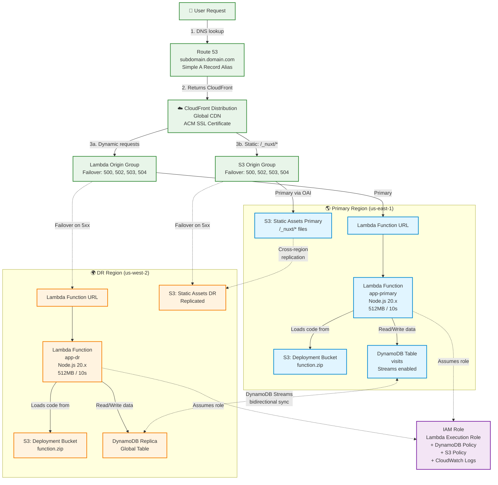

# Architecture Diagram

```mermaid
graph TB
    %% Users and DNS
    User[👤 User Request]
    R53[Route 53<br/>subdomain.domain.com<br/>Simple A Record Alias]

    %% CloudFront
    CF[☁️ CloudFront Distribution<br/>Global CDN<br/>ACM SSL Certificate]

    %% Origin Groups
    OG_Lambda[Lambda Origin Group<br/>Failover: 500, 502, 503, 504]
    OG_S3[S3 Origin Group<br/>Failover: 500, 502, 503, 504]

    %% Primary Region
    subgraph Primary["🌎 Primary Region (us-east-1)"]
        LFURL1[Lambda Function URL]
        LF1[Lambda Function<br/>app-primary<br/>Node.js 20.x<br/>512MB / 10s]
        S3D1[S3: Deployment Bucket<br/>function.zip]
        S3S1[S3: Static Assets Primary<br/>/_nuxt/* files]
        DDB1[DynamoDB Table<br/>visits<br/>Streams enabled]
    end

    %% DR Region
    subgraph DR["🌍 DR Region (us-west-2)"]
        LFURL2[Lambda Function URL]
        LF2[Lambda Function<br/>app-dr<br/>Node.js 20.x<br/>512MB / 10s]
        S3D2[S3: Deployment Bucket<br/>function.zip]
        S3S2[S3: Static Assets DR<br/>Replicated]
        DDB2[DynamoDB Replica<br/>Global Table]
    end

    %% IAM
    LR[IAM Role<br/>Lambda Execution Role<br/>+ DynamoDB Policy<br/>+ S3 Policy<br/>+ CloudWatch Logs]

    %% Request Flow
    User -->|1. DNS lookup| R53
    R53 -->|2. Returns CloudFront| CF
    CF -->|3a. Dynamic requests| OG_Lambda
    CF -->|3b. Static: /_nuxt/*| OG_S3

    %% Lambda Origin Failover
    OG_Lambda -->|Primary| LFURL1
    OG_Lambda -.->|Failover on 5xx| LFURL2

    %% S3 Origin Failover
    OG_S3 -->|Primary via OAI| S3S1
    OG_S3 -.->|Failover on 5xx| S3S2

    %% Primary Lambda
    LFURL1 --> LF1
    LF1 -->|Loads code from| S3D1
    LF1 -->|Read/Write data| DDB1
    LF1 -.->|Assumes role| LR

    %% DR Lambda
    LFURL2 --> LF2
    LF2 -->|Loads code from| S3D2
    LF2 -->|Read/Write data| DDB2
    LF2 -.->|Assumes role| LR

    %% Replication
    S3S1 -.->|Cross-region<br/>replication| S3S2
    DDB1 <-.->|DynamoDB Streams<br/>bidirectional sync| DDB2

    %% Styling
    classDef primary fill:#e1f5ff,stroke:#0288d1,stroke-width:2px
    classDef dr fill:#fff3e0,stroke:#f57c00,stroke-width:2px
    classDef global fill:#e8f5e9,stroke:#388e3c,stroke-width:2px
    classDef iam fill:#f3e5f5,stroke:#7b1fa2,stroke-width:2px

    class LFURL1,LF1,S3D1,S3S1,DDB1 primary
    class LFURL2,LF2,S3D2,S3S2,DDB2 dr
    class User,R53,CF,OG_Lambda,OG_S3 global
    class LR iam
```
